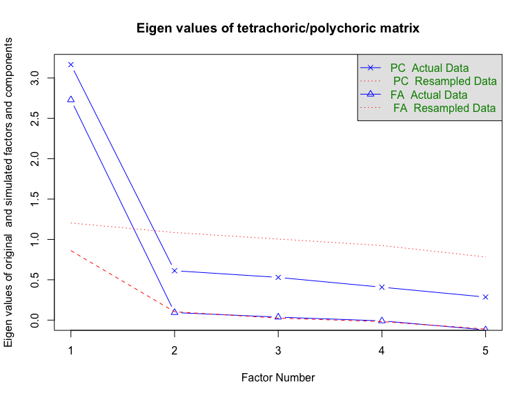
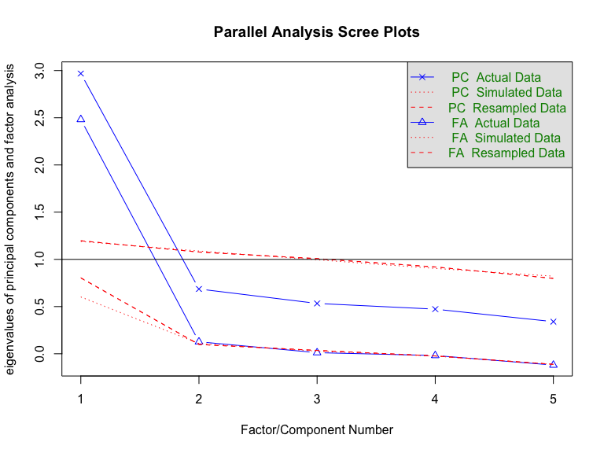

p8158\_hw2\_mc4959
================
Meiju Chen
1/29/2021

``` r
### Read in the genetic data
genetic <- read.csv("./data/genetictestingrawdata.csv",head=TRUE,sep=",") %>%
  mutate_if(is_character, as.numeric)

### Write descriptive stats to screen
summary(genetic)
```

    ##        C1              C2              C3              C4       
    ##  Min.   :1.000   Min.   :1.000   Min.   :1.000   Min.   :1.000  
    ##  1st Qu.:2.000   1st Qu.:3.000   1st Qu.:4.000   1st Qu.:3.000  
    ##  Median :3.000   Median :4.000   Median :4.000   Median :4.000  
    ##  Mean   :3.072   Mean   :3.614   Mean   :3.921   Mean   :3.477  
    ##  3rd Qu.:4.000   3rd Qu.:5.000   3rd Qu.:5.000   3rd Qu.:4.000  
    ##  Max.   :5.000   Max.   :5.000   Max.   :5.000   Max.   :5.000  
    ##                  NA's   :8       NA's   :7       NA's   :5      
    ##        C5              C6              C7             C8              C9       
    ##  Min.   :1.000   Min.   :1.000   Min.   :1.00   Min.   :1.000   Min.   :1.000  
    ##  1st Qu.:3.000   1st Qu.:2.000   1st Qu.:3.00   1st Qu.:3.000   1st Qu.:2.000  
    ##  Median :3.000   Median :3.000   Median :4.00   Median :4.000   Median :3.000  
    ##  Mean   :3.227   Mean   :3.173   Mean   :3.52   Mean   :3.723   Mean   :3.018  
    ##  3rd Qu.:4.000   3rd Qu.:4.000   3rd Qu.:4.00   3rd Qu.:5.000   3rd Qu.:4.000  
    ##  Max.   :5.000   Max.   :5.000   Max.   :5.00   Max.   :5.000   Max.   :5.000  
    ##  NA's   :3       NA's   :3                      NA's   :3       NA's   :3      
    ##       C10             C11             C12             C13       
    ##  Min.   :1.000   Min.   :1.000   Min.   :1.000   Min.   :1.000  
    ##  1st Qu.:3.000   1st Qu.:2.000   1st Qu.:2.000   1st Qu.:2.000  
    ##  Median :4.000   Median :2.000   Median :3.000   Median :3.000  
    ##  Mean   :3.823   Mean   :2.682   Mean   :3.036   Mean   :3.218  
    ##  3rd Qu.:5.000   3rd Qu.:4.000   3rd Qu.:4.000   3rd Qu.:4.000  
    ##  Max.   :5.000   Max.   :5.000   Max.   :5.000   Max.   :5.000  
    ##  NA's   :3       NA's   :3       NA's   :3       NA's   :3      
    ##       C14             C15             C16             C17            C18       
    ##  Min.   :1.000   Min.   :1.000   Min.   :1.000   Min.   :1.00   Min.   :1.000  
    ##  1st Qu.:3.000   1st Qu.:3.000   1st Qu.:3.000   1st Qu.:3.00   1st Qu.:3.000  
    ##  Median :4.000   Median :3.000   Median :4.000   Median :3.00   Median :4.000  
    ##  Mean   :3.686   Mean   :3.459   Mean   :3.832   Mean   :3.35   Mean   :3.705  
    ##  3rd Qu.:5.000   3rd Qu.:4.000   3rd Qu.:5.000   3rd Qu.:4.00   3rd Qu.:5.000  
    ##  Max.   :5.000   Max.   :5.000   Max.   :5.000   Max.   :5.00   Max.   :5.000  
    ##  NA's   :3       NA's   :3       NA's   :3       NA's   :3      NA's   :3      
    ##       C19             C20             age             race         marital     
    ##  Min.   :1.000   Min.   :1.000   Min.   :21.00   Min.   :1.00   Min.   :1.000  
    ##  1st Qu.:2.000   1st Qu.:3.000   1st Qu.:32.00   1st Qu.:1.00   1st Qu.:1.000  
    ##  Median :3.000   Median :4.000   Median :40.00   Median :1.00   Median :1.000  
    ##  Mean   :3.182   Mean   :3.668   Mean   :40.15   Mean   :1.35   Mean   :1.646  
    ##  3rd Qu.:4.000   3rd Qu.:4.000   3rd Qu.:47.00   3rd Qu.:1.00   3rd Qu.:2.000  
    ##  Max.   :5.000   Max.   :5.000   Max.   :65.00   Max.   :5.00   Max.   :5.000  
    ##  NA's   :3       NA's   :3       NA's   :3                                     
    ##     educlevl        insured      
    ##  Min.   :1.000   Min.   :0.0000  
    ##  1st Qu.:2.000   1st Qu.:1.0000  
    ##  Median :3.000   Median :1.0000  
    ##  Mean   :2.982   Mean   :0.7623  
    ##  3rd Qu.:4.000   3rd Qu.:1.0000  
    ##  Max.   :5.000   Max.   :1.0000  
    ## 

``` r
### Adds the data so variable names can be used without pre-specificaiton of dataname
attach(genetic)

### Create an object with just the 5 variables we want to analyze
usevars <- cbind(C2,C4,C5,C6,C15) 

### Here we use polychoric correlation and do parallel analysis of eigenvalues
geneticparallel <- fa.parallel.poly(usevars)
```

    ## 
    ## 
    ## 
    ##  See the graphic output for a description of the results



    ## Parallel analysis suggests that the number of factors =  1  and the number of components =  1

``` r
str(geneticparallel)
```

    ## List of 12
    ##  $ rho      : num [1:5, 1:5] 1 0.607 0.462 0.6 0.684 ...
    ##   ..- attr(*, "dimnames")=List of 2
    ##   .. ..$ : chr [1:5] "C2" "C4" "C5" "C6" ...
    ##   .. ..$ : chr [1:5] "C2" "C4" "C5" "C6" ...
    ##  $ tau      : NULL
    ##  $ n.obs    : int 223
    ##  $ Call     : language fa.parallel.poly(x = usevars)
    ##  $ fa.values: num [1:5] 2.72954 0.09336 0.03712 -0.00921 -0.12127
    ##  $ pc.values: num [1:5] 3.166 0.612 0.529 0.408 0.285
    ##  $ pc.sim   :Classes 'psych', 'describe' and 'data.frame':   5 obs. of  13 variables:
    ##   ..$ vars    : int [1:5] 1 2 3 4 5
    ##   ..$ n       : num [1:5] 10 10 10 10 10
    ##   ..$ mean    : num [1:5] 1.245 1.086 1.004 0.888 0.776
    ##   ..$ sd      : num [1:5] 0.0686 0.0455 0.0261 0.0358 0.0575
    ##   ..$ median  : num [1:5] 1.249 1.09 1.007 0.886 0.777
    ##   ..$ trimmed : num [1:5] 1.244 1.085 1.006 0.888 0.773
    ##   ..$ mad     : num [1:5] 0.0549 0.0318 0.0305 0.0398 0.074
    ##   ..$ min     : num [1:5] 1.13 1.016 0.961 0.833 0.703
    ##   ..$ max     : num [1:5] 1.37 1.17 1.035 0.947 0.873
    ##   ..$ range   : num [1:5] 0.2394 0.154 0.0739 0.1139 0.1696
    ##   ..$ skew    : num [1:5] -0.003651 0.000264 -0.356135 0.13201 0.126576
    ##   ..$ kurtosis: num [1:5] -0.884 -0.791 -1.501 -1.339 -1.448
    ##   ..$ se      : num [1:5] 0.0217 0.01439 0.00825 0.01131 0.01818
    ##  $ fa.sim   :Classes 'psych', 'describe' and 'data.frame':   5 obs. of  13 variables:
    ##   ..$ vars    : int [1:5] 1 2 3 4 5
    ##   ..$ n       : num [1:5] 10 10 10 10 10
    ##   ..$ mean    : num [1:5] 0.7136 0.1191 0.038 -0.0261 -0.1317
    ##   ..$ sd      : num [1:5] 0.3105 0.0407 0.0257 0.0207 0.0348
    ##   ..$ median  : num [1:5] 0.6818 0.1175 0.0359 -0.0227 -0.1352
    ##   ..$ trimmed : num [1:5] 0.7103 0.1166 0.0362 -0.0233 -0.1339
    ##   ..$ mad     : num [1:5] 0.4343 0.0226 0.0116 0.0154 0.0198
    ##   ..$ min     : num [1:5] 3.85e-01 5.15e-02 -6.47e-05 -7.54e-02 -1.86e-01
    ##   ..$ max     : num [1:5] 1.069677 0.206578 0.090719 0.000884 -0.059694
    ##   ..$ range   : num [1:5] 0.6851 0.155 0.0908 0.0763 0.1261
    ##   ..$ skew    : num [1:5] 0.0563 0.5129 0.5984 -1.0812 0.5873
    ##   ..$ kurtosis: num [1:5] -2.0597 -0.0303 -0.4859 0.5537 -0.3951
    ##   ..$ se      : num [1:5] 0.09819 0.01288 0.00814 0.00655 0.011
    ##  $ pcs.sim  : NULL
    ##  $ fas.sim  : NULL
    ##  $ nfact    : num 1
    ##  $ ncomp    : num 1
    ##  - attr(*, "class")= chr [1:2] "psych" "parallel"

``` r
geneticparallel$pc.values
```

    ## [1] 3.1655902 0.6120145 0.5291834 0.4078181 0.2853938

``` r
geneticparallel$pc.sim$mean
```

    ## [1] 1.2453755 1.0863475 1.0040745 0.8882779 0.7759246

``` r
### Here we use Pearson correlation (note, poly is dropped from function name)
geneticparallel.pearson <- fa.parallel(usevars)
```



    ## Parallel analysis suggests that the number of factors =  1  and the number of components =  1

``` r
str(geneticparallel.pearson)
```

    ## List of 10
    ##  $ fa.values: num [1:5] 2.4815 0.127 0.0117 -0.0186 -0.1201
    ##  $ pc.values: num [1:5] 2.968 0.686 0.533 0.473 0.34
    ##  $ pc.sim   : num [1:5] 1.19 1.089 0.995 0.904 0.822
    ##  $ pc.simr  : num [1:5] 1.197 1.077 1.008 0.92 0.798
    ##  $ fa.sim   : num [1:5] 0.6017 0.1096 0.0272 -0.0249 -0.1121
    ##  $ fa.simr  : num [1:5] 0.8036 0.0986 0.0355 -0.023 -0.1118
    ##  $ nfact    : num 1
    ##  $ ncomp    : num 1
    ##  $ Call     : language fa.parallel(x = usevars)
    ##  $ values   : num [1:20, 1:20] 1.2 1.11 1.21 1.22 1.2 ...
    ##   ..- attr(*, "dimnames")=List of 2
    ##   .. ..$ : NULL
    ##   .. ..$ : chr [1:20] "C1" "C2" "C3" "C4" ...
    ##  - attr(*, "class")= chr [1:2] "psych" "parallel"

``` r
geneticparallel.pearson$pc.values
```

    ## [1] 2.9682732 0.6861601 0.5329724 0.4726285 0.3399658

``` r
geneticparallel.pearson$pc.sim
```

    ## [1] 1.1899079 1.0886323 0.9953353 0.9041911 0.8219333

``` r
### Cronbach's alpha
geneticalpha <- alpha(usevars)
geneticalpha
```

    ##    [1] "#2297E6" "#61D04F" "#28E2E5" "#28E2E5" "#61D04F" "#61D04F" "#28E2E5"
    ##    [8] "#61D04F" "#28E2E5" "#61D04F" "#2297E6" "#DF536B" "#28E2E5" "#28E2E5"
    ##   [15] "#000000" "#DF536B" "#61D04F" "#DF536B" "#28E2E5" "#DF536B" "#61D04F"
    ##   [22] "#000000" "#DF536B" "#61D04F" "#2297E6" "#61D04F" "#61D04F" "#2297E6"
    ##   [29] "#61D04F" "#61D04F" "#2297E6" "#28E2E5" "#61D04F" "#28E2E5" "#2297E6"
    ##   [36] "#61D04F" "#2297E6" "#2297E6" "#2297E6" "#28E2E5" "#2297E6" "#61D04F"
    ##   [43] "#2297E6" "#2297E6" "#28E2E5" "#61D04F" "#2297E6" "#2297E6" "#61D04F"
    ##   [50] "#28E2E5" "#2297E6" "#28E2E5" "#2297E6" "#DF536B" "#28E2E5" "#DF536B"
    ##   [57] "#28E2E5" "#28E2E5" "#2297E6" "#2297E6" "#61D04F" "#28E2E5" "#DF536B"
    ##   [64] "#61D04F" "#28E2E5" "#61D04F" "#2297E6" "#61D04F" "#2297E6" "#2297E6"
    ##   [71] "#61D04F" "#28E2E5" "#28E2E5" "#61D04F" "#61D04F" "#28E2E5" "#61D04F"
    ##   [78] "#28E2E5" "#61D04F" "#2297E6" "#DF536B" "#28E2E5" "#28E2E5" "#000000"
    ##   [85] "#DF536B" "#61D04F" "#DF536B" "#28E2E5" "#DF536B" "#61D04F" "#000000"
    ##   [92] "#DF536B" "#61D04F" "#2297E6" "#61D04F" "#61D04F" "#2297E6" "#61D04F"
    ##   [99] "#61D04F" "#2297E6" "#28E2E5" "#61D04F" "#28E2E5" "#2297E6" "#61D04F"
    ##  [106] "#2297E6" "#2297E6" "#2297E6" "#28E2E5" "#2297E6" "#61D04F" "#2297E6"
    ##  [113] "#2297E6" "#28E2E5" "#61D04F" "#2297E6" "#2297E6" "#61D04F" "#28E2E5"
    ##  [120] "#2297E6" "#28E2E5" "#2297E6" "#DF536B" "#28E2E5" "#DF536B" "#28E2E5"
    ##  [127] "#28E2E5" "#2297E6" "#2297E6" "#61D04F" "#28E2E5" "#DF536B" "#61D04F"
    ##  [134] "#28E2E5" "#61D04F" "#2297E6" "#61D04F" "#2297E6" "#61D04F" "#28E2E5"
    ##  [141] "#28E2E5" "#61D04F" "#61D04F" "#28E2E5" "#61D04F" "#28E2E5" "#61D04F"
    ##  [148] "#2297E6" "#DF536B" "#28E2E5" "#28E2E5" "#000000" "#DF536B" "#61D04F"
    ##  [155] "#DF536B" "#28E2E5" "#DF536B" "#61D04F" "#000000" "#DF536B" "#61D04F"
    ##  [162] "#2297E6" "#61D04F" "#61D04F" "#2297E6" "#61D04F" "#61D04F" "#2297E6"
    ##  [169] "#28E2E5" "#61D04F" "#28E2E5" "#2297E6" "#61D04F" "#2297E6" "#2297E6"
    ##  [176] "#2297E6" "#28E2E5" "#2297E6" "#61D04F" "#2297E6" "#2297E6" "#28E2E5"
    ##  [183] "#61D04F" "#2297E6" "#2297E6" "#61D04F" "#28E2E5" "#2297E6" "#28E2E5"
    ##  [190] "#2297E6" "#DF536B" "#28E2E5" "#DF536B" "#28E2E5" "#28E2E5" "#2297E6"
    ##  [197] "#2297E6" "#61D04F" "#28E2E5" "#DF536B" "#61D04F" "#28E2E5" "#61D04F"
    ##  [204] "#2297E6" "#61D04F" NA        NA        NA        NA        NA       
    ##  [211] NA        NA        NA        "#28E2E5" "#61D04F" "#2297E6" "#DF536B"
    ##  [218] "#28E2E5" "#28E2E5" "#000000" "#DF536B" "#61D04F" "#DF536B" "#2297E6"
    ##  [225] "#61D04F" "#2297E6" "#28E2E5" "#61D04F" "#2297E6" "#2297E6" "#DF536B"
    ##  [232] "#2297E6" "#2297E6" "#28E2E5" "#61D04F" "#61D04F" "#2297E6" "#000000"
    ##  [239] "#61D04F" "#2297E6" "#DF536B" "#2297E6" "#61D04F" "#000000" "#DF536B"
    ##  [246] "#000000" "#2297E6" "#2297E6" "#61D04F" "#2297E6" "#61D04F" "#61D04F"
    ##  [253] "#2297E6" "#DF536B" "#2297E6" "#61D04F" "#2297E6" "#2297E6" "#DF536B"
    ##  [260] "#28E2E5" "#DF536B" "#2297E6" "#2297E6" "#2297E6" "#61D04F" "#61D04F"
    ##  [267] "#2297E6" "#28E2E5" "#2297E6" "#2297E6" "#2297E6" "#2297E6" "#61D04F"
    ##  [274] "#2297E6" "#2297E6" "#28E2E5" "#61D04F" "#2297E6" "#2297E6" "#28E2E5"
    ##  [281] "#61D04F" "#2297E6" "#2297E6" "#000000" "#2297E6" "#DF536B" "#61D04F"
    ##  [288] "#28E2E5" "#28E2E5" "#61D04F" "#61D04F" "#2297E6" "#2297E6" "#61D04F"
    ##  [295] "#2297E6" "#28E2E5" "#61D04F" "#2297E6" "#2297E6" "#DF536B" "#2297E6"
    ##  [302] "#2297E6" "#28E2E5" "#61D04F" "#61D04F" "#2297E6" "#000000" "#61D04F"
    ##  [309] "#2297E6" "#DF536B" "#2297E6" "#61D04F" "#000000" "#DF536B" "#000000"
    ##  [316] "#2297E6" "#2297E6" "#61D04F" "#2297E6" "#61D04F" "#61D04F" "#2297E6"
    ##  [323] "#DF536B" "#2297E6" "#61D04F" "#2297E6" "#2297E6" "#DF536B" "#28E2E5"
    ##  [330] "#DF536B" "#2297E6" "#2297E6" "#2297E6" "#61D04F" "#61D04F" "#2297E6"
    ##  [337] "#28E2E5" "#2297E6" "#2297E6" "#2297E6" "#2297E6" "#61D04F" "#2297E6"
    ##  [344] "#2297E6" "#28E2E5" "#61D04F" "#2297E6" "#2297E6" "#28E2E5" "#61D04F"
    ##  [351] "#2297E6" "#2297E6" "#000000" "#2297E6" "#DF536B" "#61D04F" "#28E2E5"
    ##  [358] "#28E2E5" "#61D04F" "#61D04F" "#2297E6" "#61D04F" "#2297E6" "#28E2E5"
    ##  [365] "#61D04F" "#2297E6" "#2297E6" "#DF536B" "#2297E6" "#2297E6" "#28E2E5"
    ##  [372] "#61D04F" "#61D04F" "#2297E6" "#000000" "#61D04F" "#2297E6" "#DF536B"
    ##  [379] "#2297E6" "#61D04F" "#000000" "#DF536B" "#000000" "#2297E6" "#2297E6"
    ##  [386] "#61D04F" "#2297E6" "#61D04F" "#61D04F" "#2297E6" "#DF536B" "#2297E6"
    ##  [393] "#61D04F" "#2297E6" "#2297E6" "#DF536B" "#28E2E5" "#DF536B" "#2297E6"
    ##  [400] "#2297E6" "#2297E6" "#61D04F" "#61D04F" "#2297E6" "#28E2E5" "#2297E6"
    ##  [407] "#2297E6" "#2297E6" "#2297E6" "#61D04F" "#2297E6" "#2297E6" "#28E2E5"
    ##  [414] "#61D04F" "#2297E6" "#2297E6" "#28E2E5" "#61D04F" "#2297E6" "#2297E6"
    ##  [421] "#000000" "#2297E6" "#DF536B" "#61D04F" "#28E2E5" "#28E2E5" "#61D04F"
    ##  [428] "#61D04F" "#2297E6" "#61D04F" "#2297E6" "#28E2E5" "#61D04F" "#2297E6"
    ##  [435] "#2297E6" "#DF536B" "#2297E6" "#2297E6" NA        NA        NA       
    ##  [442] NA        NA        "#61D04F" "#2297E6" "#DF536B" "#2297E6" "#61D04F"
    ##  [449] "#2297E6" "#2297E6" "#2297E6" "#28E2E5" "#2297E6" "#61D04F" "#2297E6"
    ##  [456] "#61D04F" "#28E2E5" "#61D04F" "#61D04F" "#28E2E5" "#000000" "#61D04F"
    ##  [463] "#61D04F" "#DF536B" "#2297E6" "#DF536B" "#000000" "#61D04F" "#2297E6"
    ##  [470] "#61D04F" "#2297E6" "#2297E6" "#61D04F" "#61D04F" "#61D04F" "#2297E6"
    ##  [477] "#DF536B" "#61D04F" "#61D04F" "#61D04F" "#61D04F" "#DF536B" "#2297E6"
    ##  [484] "#61D04F" "#2297E6" "#2297E6" "#2297E6" "#2297E6" "#2297E6" "#000000"
    ##  [491] "#DF536B" "#DF536B" "#2297E6" "#DF536B" "#DF536B" "#2297E6" "#61D04F"
    ##  [498] "#28E2E5" "#2297E6" "#DF536B" "#2297E6" "#DF536B" "#2297E6" "#61D04F"
    ##  [505] "#DF536B" "#2297E6" "#2297E6" "#DF536B" "#000000" "#2297E6" "#28E2E5"
    ##  [512] "#61D04F" "#000000" "#2297E6" "#2297E6" "#2297E6" "#61D04F" "#2297E6"
    ##  [519] "#2297E6" "#2297E6" "#28E2E5" "#2297E6" "#61D04F" "#2297E6" "#61D04F"
    ##  [526] "#28E2E5" "#61D04F" "#61D04F" "#28E2E5" "#000000" "#61D04F" "#61D04F"
    ##  [533] "#DF536B" "#2297E6" "#DF536B" "#000000" "#61D04F" "#2297E6" "#61D04F"
    ##  [540] "#2297E6" "#2297E6" "#61D04F" "#61D04F" "#61D04F" "#2297E6" "#DF536B"
    ##  [547] "#61D04F" "#61D04F" "#61D04F" "#61D04F" "#DF536B" "#2297E6" "#61D04F"
    ##  [554] "#2297E6" "#2297E6" "#2297E6" "#2297E6" "#2297E6" "#000000" "#DF536B"
    ##  [561] "#DF536B" "#2297E6" "#DF536B" "#DF536B" "#2297E6" "#61D04F" "#28E2E5"
    ##  [568] "#2297E6" "#DF536B" "#2297E6" "#DF536B" "#2297E6" "#61D04F" "#DF536B"
    ##  [575] "#2297E6" "#2297E6" "#DF536B" "#000000" "#2297E6" "#28E2E5" "#61D04F"
    ##  [582] "#000000" "#2297E6" "#2297E6" "#61D04F" "#2297E6" "#2297E6" "#2297E6"
    ##  [589] "#28E2E5" "#2297E6" "#61D04F" "#2297E6" "#61D04F" "#28E2E5" "#61D04F"
    ##  [596] "#61D04F" "#28E2E5" "#000000" "#61D04F" "#61D04F" "#DF536B" "#2297E6"
    ##  [603] "#DF536B" "#000000" "#61D04F" "#2297E6" "#61D04F" "#2297E6" "#2297E6"
    ##  [610] "#61D04F" "#61D04F" "#61D04F" "#2297E6" "#DF536B" "#61D04F" "#61D04F"
    ##  [617] "#61D04F" "#61D04F" "#DF536B" "#2297E6" "#61D04F" "#2297E6" "#2297E6"
    ##  [624] "#2297E6" "#2297E6" "#2297E6" "#000000" "#DF536B" "#DF536B" "#2297E6"
    ##  [631] "#DF536B" "#DF536B" "#2297E6" "#61D04F" "#28E2E5" "#2297E6" "#DF536B"
    ##  [638] "#2297E6" "#DF536B" "#2297E6" "#61D04F" "#DF536B" "#2297E6" "#2297E6"
    ##  [645] "#DF536B" "#000000" "#2297E6" "#28E2E5" "#61D04F" "#000000" "#2297E6"
    ##  [652] "#2297E6" NA        NA        NA        "#2297E6" "#28E2E5" "#2297E6"
    ##  [659] "#61D04F" "#2297E6" "#61D04F" "#28E2E5" "#61D04F" "#61D04F" "#28E2E5"
    ##  [666] "#000000" "#61D04F" "#61D04F" "#DF536B" "#DF536B" "#DF536B" "#2297E6"
    ##  [673] "#2297E6" "#2297E6" "#000000" "#28E2E5" "#DF536B" "#2297E6" "#2297E6"
    ##  [680] "#28E2E5" "#61D04F" "#28E2E5" "#28E2E5" "#000000" "#DF536B" "#61D04F"
    ##  [687] "#DF536B" "#61D04F" "#DF536B" "#000000" "#000000" "#2297E6" "#2297E6"
    ##  [694] "#61D04F" "#2297E6" "#61D04F" "#DF536B" "#2297E6" "#2297E6" "#DF536B"
    ##  [701] "#2297E6" "#2297E6" "#61D04F" "#2297E6" "#DF536B" "#2297E6" "#DF536B"
    ##  [708] "#2297E6" "#28E2E5" "#2297E6" "#61D04F" "#61D04F" "#61D04F" "#28E2E5"
    ##  [715] "#61D04F" "#2297E6" "#61D04F" "#000000" "#2297E6" "#2297E6" "#2297E6"
    ##  [722] "#2297E6" "#DF536B" "#2297E6" "#61D04F" "#28E2E5" "#28E2E5" "#61D04F"
    ##  [729] "#2297E6" "#2297E6" "#DF536B" "#DF536B" "#61D04F" "#000000" "#DF536B"
    ##  [736] "#000000" "#61D04F" "#DF536B" "#DF536B" "#DF536B" "#2297E6" "#2297E6"
    ##  [743] "#2297E6" "#000000" "#28E2E5" "#DF536B" "#2297E6" "#2297E6" "#28E2E5"
    ##  [750] "#61D04F" "#28E2E5" "#28E2E5" "#000000" "#DF536B" "#61D04F" "#DF536B"
    ##  [757] "#61D04F" "#DF536B" "#000000" "#000000" "#2297E6" "#2297E6" "#61D04F"
    ##  [764] "#2297E6" "#61D04F" "#DF536B" "#2297E6" "#2297E6" "#DF536B" "#2297E6"
    ##  [771] "#2297E6" "#61D04F" "#2297E6" "#DF536B" "#2297E6" "#DF536B" "#2297E6"
    ##  [778] "#28E2E5" "#2297E6" "#61D04F" "#61D04F" "#61D04F" "#28E2E5" "#61D04F"
    ##  [785] "#2297E6" "#61D04F" "#000000" "#2297E6" "#2297E6" "#2297E6" "#2297E6"
    ##  [792] "#DF536B" "#2297E6" "#61D04F" "#28E2E5" "#28E2E5" "#61D04F" "#2297E6"
    ##  [799] "#2297E6" "#DF536B" "#DF536B" "#61D04F" "#000000" "#DF536B" "#000000"
    ##  [806] "#61D04F" "#DF536B" "#DF536B" "#2297E6" "#2297E6" "#2297E6" "#000000"
    ##  [813] "#28E2E5" "#DF536B" "#2297E6" "#2297E6" "#28E2E5" "#61D04F" "#28E2E5"
    ##  [820] "#28E2E5" "#000000" "#DF536B" "#61D04F" "#DF536B" "#61D04F" "#DF536B"
    ##  [827] "#000000" "#000000" "#2297E6" "#2297E6" "#61D04F" "#2297E6" "#61D04F"
    ##  [834] "#DF536B" "#2297E6" "#2297E6" "#DF536B" "#2297E6" "#2297E6" "#61D04F"
    ##  [841] "#2297E6" "#DF536B" "#2297E6" "#DF536B" "#2297E6" "#28E2E5" "#2297E6"
    ##  [848] "#61D04F" "#61D04F" "#61D04F" "#28E2E5" "#61D04F" "#2297E6" "#61D04F"
    ##  [855] "#000000" "#2297E6" "#2297E6" "#2297E6" "#2297E6" "#DF536B" "#2297E6"
    ##  [862] "#61D04F" "#28E2E5" "#28E2E5" "#61D04F" "#2297E6" "#2297E6" "#DF536B"
    ##  [869] "#DF536B" "#61D04F" "#000000" "#DF536B" "#000000" "#61D04F" "#DF536B"
    ##  [876] "#DF536B" "#2297E6" "#2297E6" NA        NA        NA        "#DF536B"
    ##  [883] "#2297E6" "#2297E6" "#28E2E5" "#61D04F" "#28E2E5" "#28E2E5" "#000000"
    ##  [890] "#DF536B" "#61D04F" "#DF536B" "#2297E6" "#61D04F" "#61D04F" "#2297E6"
    ##  [897] "#61D04F" "#2297E6" "#2297E6" "#2297E6" "#61D04F" "#61D04F" "#28E2E5"
    ##  [904] "#DF536B" "#28E2E5" "#2297E6" "#000000" "#DF536B" "#DF536B" "#DF536B"
    ##  [911] "#2297E6" "#DF536B" "#DF536B" "#DF536B" "#2297E6" "#61D04F" "#28E2E5"
    ##  [918] "#2297E6" "#61D04F" "#000000" "#28E2E5" "#61D04F" "#61D04F" "#2297E6"
    ##  [925] "#2297E6" "#28E2E5" "#61D04F" "#DF536B" "#28E2E5" "#61D04F" "#61D04F"
    ##  [932] "#2297E6" "#61D04F" "#61D04F" "#2297E6" "#61D04F" "#28E2E5" "#61D04F"
    ##  [939] "#2297E6" "#28E2E5" "#61D04F" "#28E2E5" "#2297E6" "#28E2E5" "#2297E6"
    ##  [946] "#61D04F" "#2297E6" "#61D04F" "#28E2E5" "#2297E6" "#61D04F" "#28E2E5"
    ##  [953] "#DF536B" "#28E2E5" "#000000" "#61D04F" "#28E2E5" "#61D04F" "#DF536B"
    ##  [960] "#61D04F" "#2297E6" "#2297E6" "#61D04F" "#61D04F" "#2297E6" "#61D04F"
    ##  [967] "#2297E6" "#2297E6" "#2297E6" "#61D04F" "#61D04F" "#28E2E5" "#DF536B"
    ##  [974] "#28E2E5" "#2297E6" "#000000" "#DF536B" "#DF536B" "#61D04F" "#2297E6"
    ##  [981] "#DF536B" "#DF536B" "#DF536B" "#2297E6" "#61D04F" "#28E2E5" "#2297E6"
    ##  [988] "#61D04F" "#000000" "#28E2E5" "#61D04F" "#61D04F" "#2297E6" "#2297E6"
    ##  [995] "#28E2E5" "#61D04F" "#DF536B" "#28E2E5" "#61D04F" "#61D04F" "#2297E6"
    ## [1002] "#61D04F" "#61D04F" "#2297E6" "#61D04F" "#28E2E5" "#61D04F" "#2297E6"
    ## [1009] "#28E2E5" "#61D04F" "#28E2E5" "#2297E6" "#28E2E5" "#2297E6" "#61D04F"
    ## [1016] "#2297E6" "#61D04F" "#28E2E5" "#2297E6" "#61D04F" "#28E2E5" "#DF536B"
    ## [1023] "#28E2E5" "#000000" "#61D04F" "#28E2E5" "#61D04F" "#DF536B" "#61D04F"
    ## [1030] "#2297E6" "#61D04F" "#61D04F" "#2297E6" "#61D04F" "#2297E6" "#2297E6"
    ## [1037] "#2297E6" "#61D04F" "#61D04F" "#28E2E5" "#DF536B" "#28E2E5" "#2297E6"
    ## [1044] "#000000" "#DF536B" "#DF536B" "#2297E6" "#2297E6" "#DF536B" "#DF536B"
    ## [1051] "#DF536B" "#2297E6" "#61D04F" "#28E2E5" "#2297E6" "#61D04F" "#000000"
    ## [1058] "#28E2E5" "#61D04F" "#61D04F" "#2297E6" "#2297E6" "#28E2E5" "#61D04F"
    ## [1065] "#DF536B" "#28E2E5" "#61D04F" "#61D04F" "#2297E6" "#61D04F" "#61D04F"
    ## [1072] "#2297E6" "#61D04F" "#28E2E5" "#61D04F" "#2297E6" "#28E2E5" "#61D04F"
    ## [1079] "#28E2E5" "#2297E6" "#28E2E5" "#2297E6" "#61D04F" "#2297E6" "#61D04F"
    ## [1086] "#28E2E5" "#2297E6" "#61D04F" "#28E2E5" "#DF536B" "#28E2E5" "#000000"
    ## [1093] "#61D04F" "#28E2E5" "#61D04F" "#DF536B" "#61D04F" "#2297E6" "#61D04F"
    ## [1100] "#61D04F" "#2297E6" "#61D04F" "#2297E6" "#2297E6" "#2297E6" "#61D04F"
    ## [1107] "#61D04F" "#28E2E5" "#DF536B" "#28E2E5" "#2297E6" "#000000" NA       
    ## [1114] NA        NA
